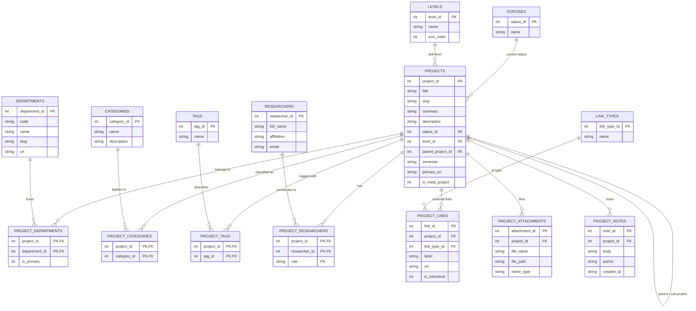

# BBS Database -- ER Diagram

## Reading the diagram

- The center is `PROJECTS`. Everything else either describes a project (status, level, parent), classifies a project (department, category, tag, level), or hangs off a project (links, attachments, notes, researchers).
- All four "describes a project" relationships are many-to-many: a project can be in multiple departments and categories and have many tags and researchers.
- `parent_project_id` is a self-reference so the table also captures sub-project hierarchies (BSP > World Building, AI Image Generators Evaluation > Prompt 1/2/3/Rankings, etc.).
